# EECS4413_Group_Project_WS

## Project Setup

#### Prerequisites
- Git https://git-scm.com/
- Eclipse Enterprise edition https://www.eclipse.org/downloads/packages/release/kepler/sr2/eclipse-ide-java-ee-developers
- Java https://www.oracle.com/ca-en/java/technologies/downloads/
- Tomcat Server https://tomcat.apache.org/download-90.cgi

#### Setup
1. Clone project
```
git clone https://github.com/Faizi-AdnanFahad/EECS4413_Group_Project_WS.git
```
2. Import projects into eclipse and then sync maven dependencies https://maven.apache.org/
3. Click on import in eclipse > General, the click on Exisiting projects into workspace.
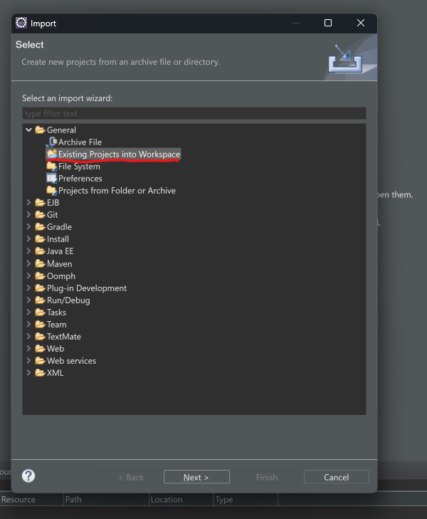
4. Select a root directory and browse to the location of the electricVehicleSystem project that was cloned from the repository
- 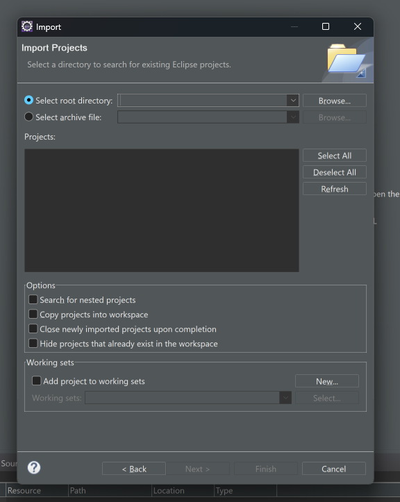
5. Setup the tomcat server by clicking new > other
- 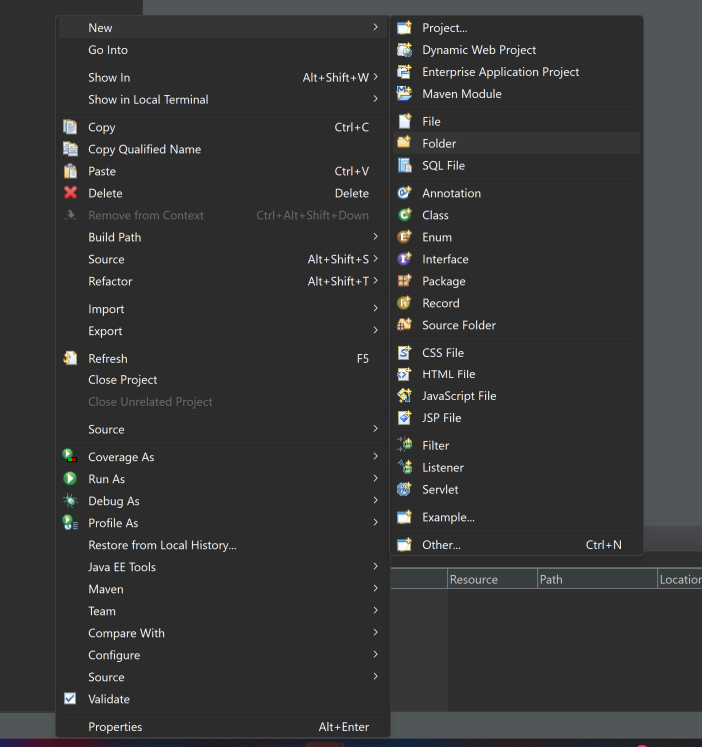
7. Select  the Server
- 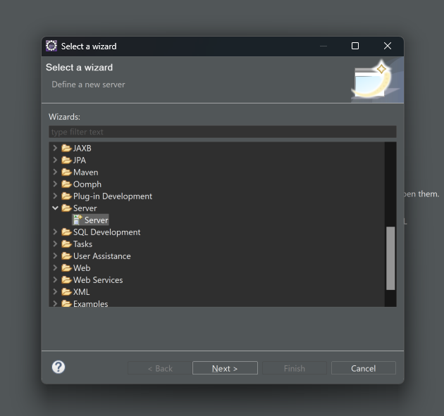
8. Choose Tomcat 10.1 server.
- 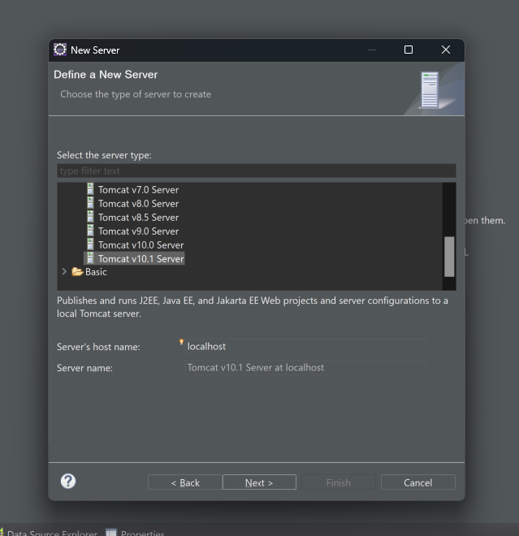
9. Browse to the location of downloaded Tomcat driver downloaded.
- 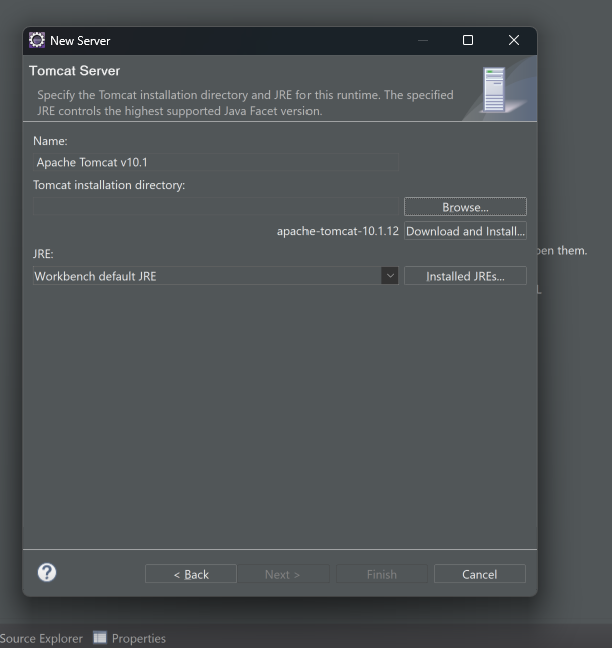
11. Click on the tomcat server and change the admin port to 8005
- 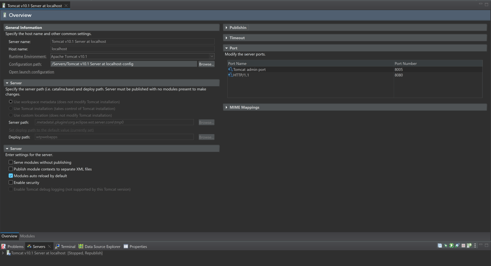
12. Set your eclipse working directory to be the project root folder (Important for retrivering the data from the SQLlite database)
  - Click on Run > Run Configuration
    - 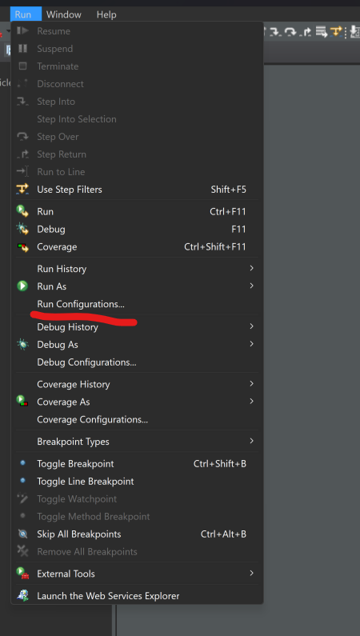
  - Go to arguments tab
    - 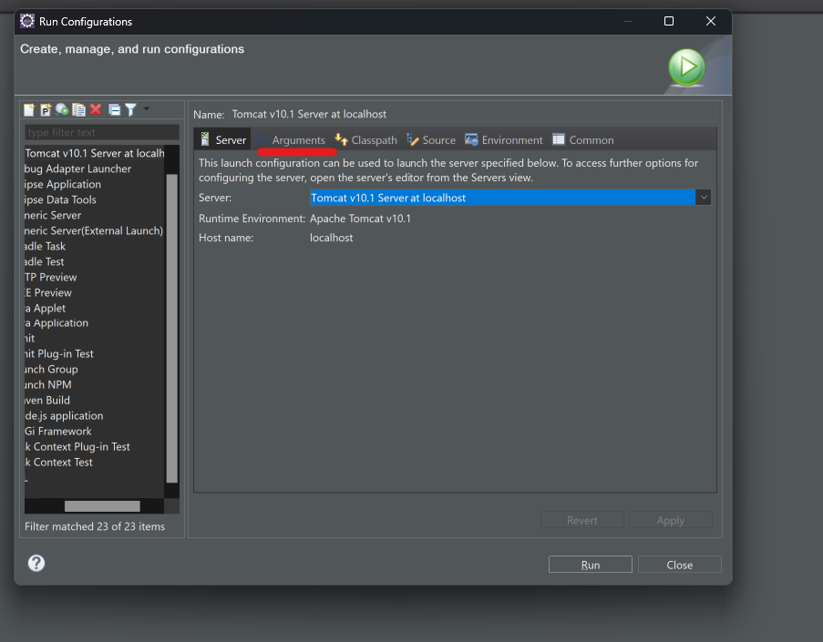
  - Click on other and then File System and set your eclipse working directory to be the project root folder 
    - 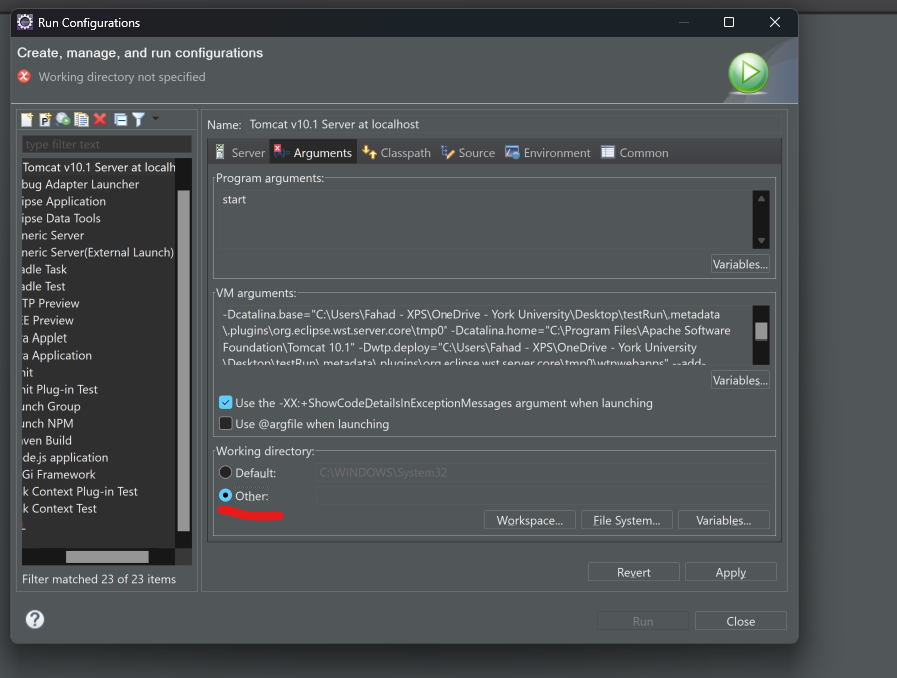

**Important**
If step 12 is not followed correctly, the website will not show the data from the database. In this case, you can set the path to the database to the absolute path.
  - Go to \electricVehicleSystem\src\main\webapp\META-INF\context.xml
  - Put the absolute path in the url="jdbc:sqlite" + "absolute path of the electricVehcileSystem.db" which exists in the project root folder.

13. Funally, you can run the application on the Tomcat server.
- 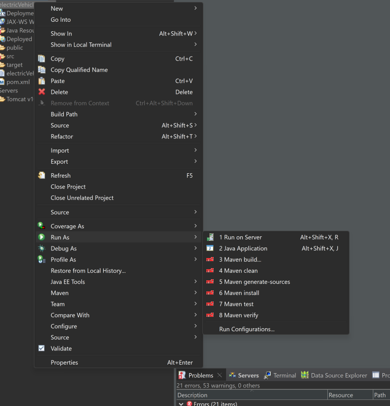

Additionally, the project is deployed on the AWS cloud with EC2 on the following link: http://54.166.233.199/electricVehicleSystem/
However, according to the credit given on AWS, the lab and machine should be running when the trying to access the above link which is only accessible for 4 hours.
